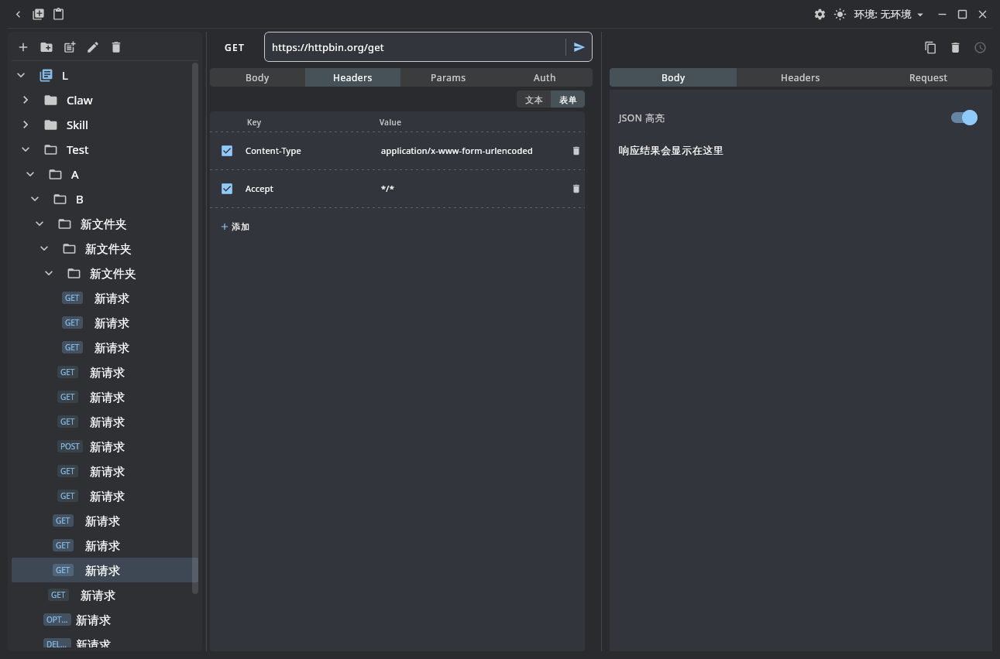
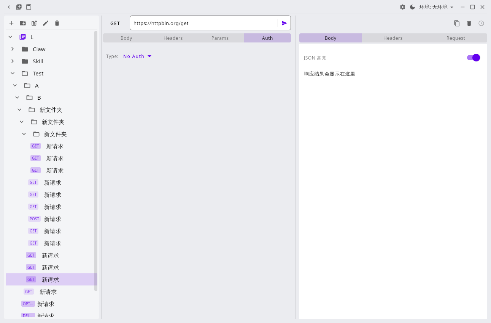
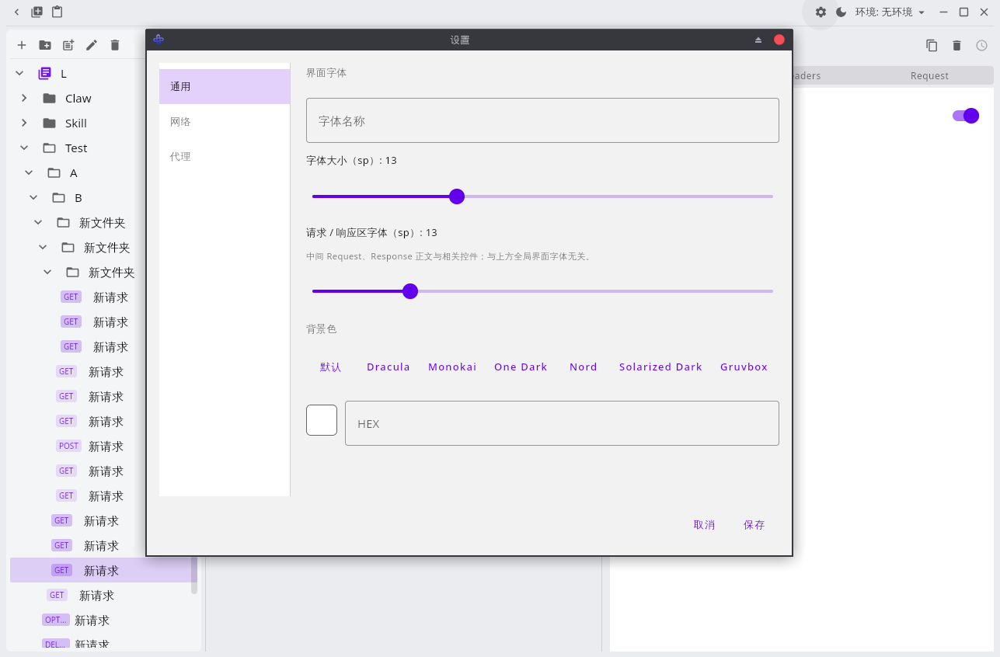
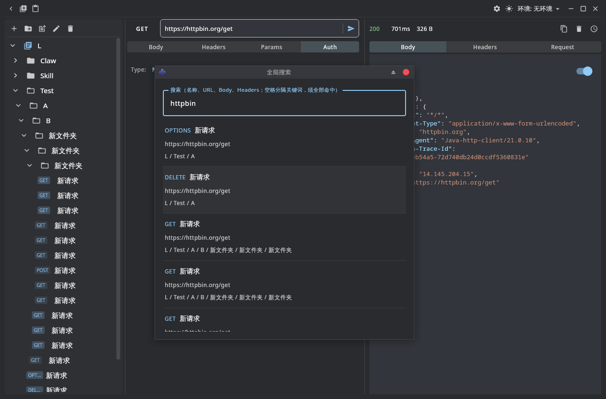
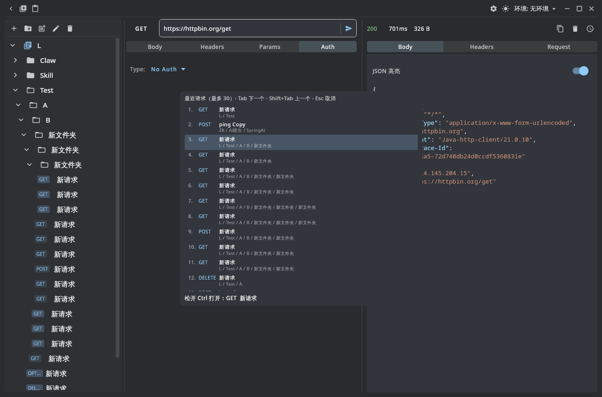
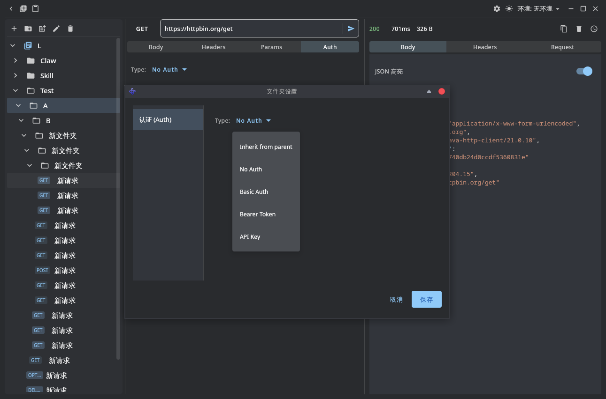

# Api-X

[English](Readme.md)

JDK 21

- `gradle run` 调试运行
- `gradle createDistributable` 打包

## 功能列表

- 顶栏 **Push / Pull**：将集合按 id 导出到应用数据目录下 `data/collection/*.json`（Postman v2.1），环境为 `data/env/environments.json`；Pull 从该目录合并进本地（仅新增与更新、不删）。可对该 `data` 目录做 Git 管理。详见 `DataDirSync`、`AppPaths`。
- 在**未重定向的**主数据目录的 `app-settings.properties` 中设置 `debugHome=路径`，可将**全部**数据根目录指到空目录，便于隔离调试、不影响正式数据。
- 导入导出 Postman Collection 格式数据
- 主题切换
- 请求运行日志
- Ctrl+K 全局搜索
- Ctrl+Tab 切换最近 Request
- 多 Env 切换和变量解析
- 文件夹 Auth 继承

## 页面截图

## 技术博客

面向 Java 开发者与 Kotlin 初学者，通过 Api-X 项目学习 Compose Desktop 开发。

> 完整大纲：[doc/toc.md](doc/toc.md)

### 第一章：Kotlin 入门与桌面开发基础

| 博客 | 主题 | 关键内容 |
|------|------|----------|
| [01-basic-kotlin.md](doc/01-basic-kotlin.md) | 从 Java 到 Kotlin：语法快速上手 | var/val、data class、lambda、空安全、扩展函数 |
| [02-compose-desktop.md](doc/02-compose-desktop.md) | Compose Desktop 初体验 | @Composable、状态管理、remember、LaunchedEffect |
| [03-compose-layout.md](doc/03-compose-layout.md) | Compose 布局基础与 Material Design | Row/Column/Box、LazyColumn、MaterialTheme、Modifier |

### 第二章：项目核心功能实现

| 博客 | 主题 | 关键内容 |
|------|------|----------|
| [04-http-kt.md](doc/04-http-kt.md) | Java HttpURLConnection 到 Kotlin 协程 | JDK 21 HttpClient、suspend、Flow、流式响应 |
| [05-request-response.md](doc/05-request-response.md) | 请求面板与响应展示实现 | 状态驱动、JSON 高亮、表单处理、请求历史 |
| [06-sqlite-kt.md](doc/06-sqlite-kt.md) | SQLite 在 Kotlin 中的使用 | JDBC、Schema 迁移、CRUD 操作 |
| [07-serialization.md](doc/07-serialization.md) | 序列化与 JSON 处理 | kotlinx.serialization、Postman 格式导入导出 |
| [08-environment.md](doc/08-environment.md) | 环境变量系统设计 | 环境切换、变量替换、Auth 继承 |

### 第三章：UI 交互与用户体验

| 博客 | 主题 | 关键内容 |
|------|------|----------|
| [09-tree-sidebar.md](doc/09-tree-sidebar.md) | Compose 树形组件与侧边栏 | LazyColumn 多级树、展开收起、拖拽 |
| [10-dialogs-overlay.md](doc/10-dialogs-overlay.md) | 对话框与全局搜索 | Dialog、Ctrl+K 搜索、RecentRequest 切换 |
| [11-theming.md](doc/11-theming.md) | Compose 主题系统与动态配色 | Material3、深浅主题切换、Hex 解析 |
| [12-shortcuts.md](doc/12-shortcuts.md) | 桌面应用快捷键绑定 | KeyEvent、Ctrl+Tab、冲突处理 |

### 第四章：工程实践

| 博客 | 主题 | 关键内容 |
|------|------|----------|
| [13-architecture.md](doc/13-architecture.md) | Kotlin 桌面应用架构设计 | MVVM、Repository、模块分包 |
| [14-gradle-build.md](doc/14-gradle-build.md) | Gradle Kotlin DSL 与打包配置 | Compose Desktop 打包、JVM 参数 |
| [15-postman-sync.md](doc/15-postman-sync.md) | Postman 数据格式兼容 | Postman v2.1、Push/Pull 同步、Git 管理 |
| [16-debug-perf.md](doc/16-debug-perf.md) | JDK 21 调试与性能监控 | JFR、NativeMemoryTracking、Skiko 渲染 |
