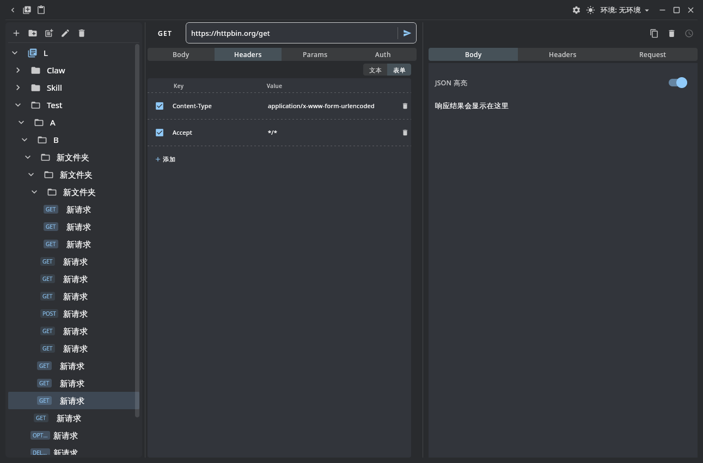
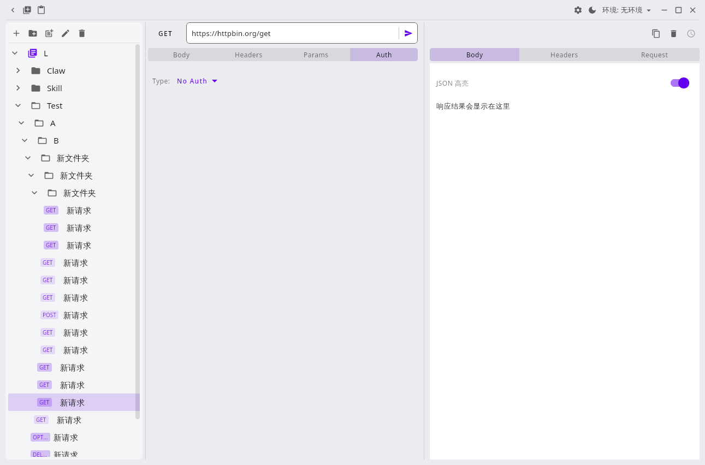
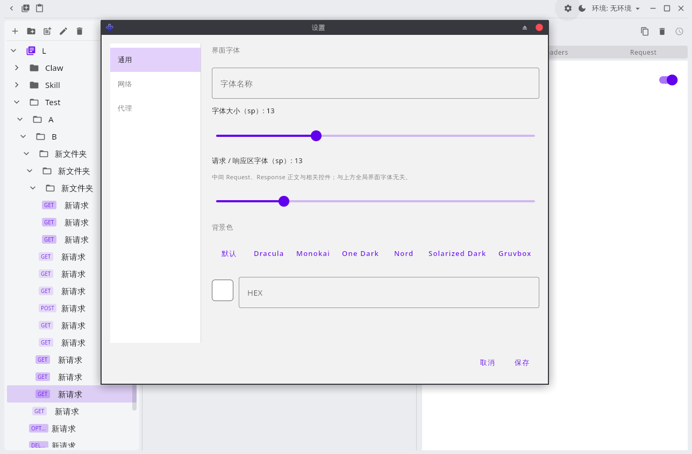
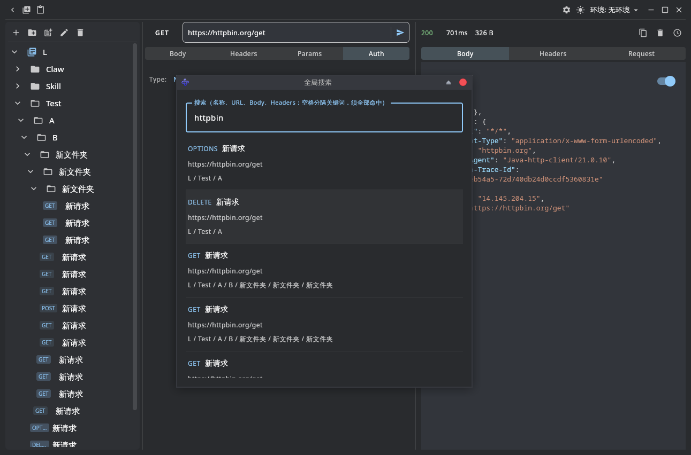
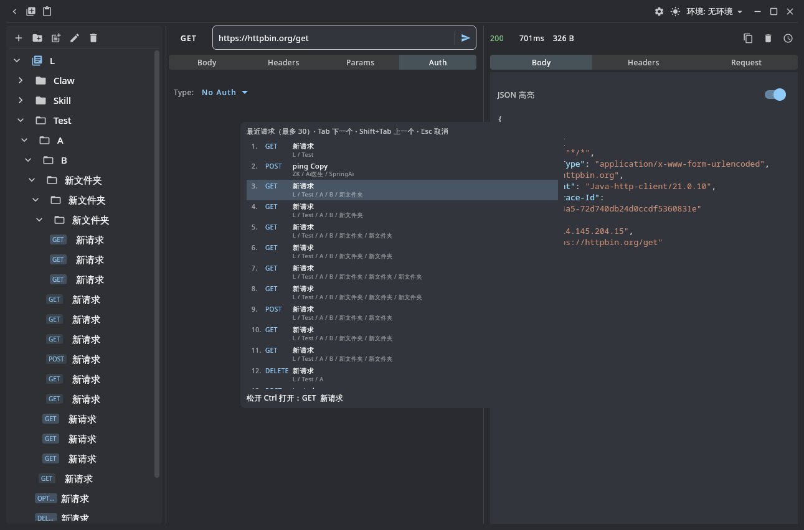
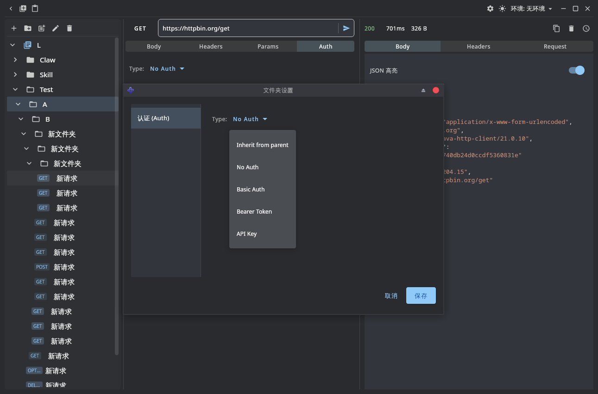

# Api-X

[English](Readme.md)

JDK 25 JBR + Gradle 9.4.1 + Kotlin 2.4.0 + Compose 1.12.0

- `gradle run` 调试运行
- `gradle createDistributable` 构建可分发应用目录
- `gradle packageMsi` 构建 Windows MSI 安装包

本地数据所在目录：`~/.local/share/api-x`

## 项目概览

Api-X 是一个面向 Java 后端开发者的 Compose Desktop API 调试工具，重点服务于 Spring Boot、Spring AI、AgentScope 以及 MCP Agent 工具调试场景。

它更关注本地开发中的真实调试闭环：集合、环境变量、认证继承、请求/响应历史、OpenAPI 同步、SSE 流式响应，以及 MCP tool/resource/prompt 调试。

## 核心功能

- **HTTP 请求调试**：多标签请求编辑，Headers/Params/Body/Auth 面板，流式响应展示，响应搜索，请求执行日志。
- **集合树管理**：Collection、Folder、Request，支持拖拽排序、重命名、删除、复制和全局搜索。
- **环境变量**：多环境切换，变量替换，集合/文件夹/请求级 Auth 继承，环境管理器。
- **Postman 兼容**：导入/导出 Postman Collection v2.1，并保留 `_api_x_id` 元数据用于稳定合并。
- **数据目录同步**：顶栏 **Push** 将集合导出到 `data/collection/{id}.json`，环境导出到 `data/env/`；**Pull** 按 id 合并，不删除本地数据。该 `data` 目录适合 Git 管理。
- **调试数据根目录**：在默认数据目录的 `app-settings.properties` 中设置 `debugHome=路径`，可以把全部 DB/文件重定向到沙箱目录，避免影响正式数据。
- **快捷键**：`Ctrl+K` 全局搜索，`Ctrl+Tab` 切换最近 Request。
- **主题与界面**：深色/浅色主题，自定义颜色，可拖拽侧边栏，窗口和树展开状态持久化。

## Spring Boot / OpenAPI 工作流

Api-X 可以从 Spring Boot 的 OpenAPI 地址创建和刷新集合，例如：

```text
http://localhost:8080/v3/api-docs
```

创建集合时也可以省略协议：

```text
localhost:8080/v3/api-docs
```

Api-X 会默认按 `http://` 请求。

OpenAPI 行为：

- 一个 OpenAPI 地址对应一个 Collection。
- OpenAPI `tags` 对应 Folder。
- paths/operations 对应 Request。
- OpenAPI 地址会保存到 Collection 元数据里，后续可在 Collection 设置中修改。
- 右键已绑定 OpenAPI 的 Collection，可以选择 **刷新 OpenAPI**。
- 刷新时使用 `METHOD + normalized path` 作为同步 key，因此 `/users/{id}` 和 `/users/{userId}` 会被视为同一个接口形态。
- 刷新会保留本地调试状态，例如已编辑的 URL、Headers、Params、Body、Auth、Request id 和响应历史。
- 当前版本不会自动删除服务端已移除的接口，避免误删本地调试数据。

## MCP 调试

Api-X 内置会话型 MCP 调试器，方便 Agent tool 开发和联调。

支持的流程：

- 连接 MCP SSE endpoint，并保持同一个会话。
- 初始化后将 `tools/list`、`resources/list`、`prompts/list` 加载到左侧树。
- 点击 tool/resource/prompt 只切换编辑上下文，不重新连接。
- 在同一个会话里连续发送 `tools/call`、`resources/read`、`prompts/get`。
- 右侧统一展示协议消息、通知、原始流日志和响应内容。
- MCP catalog、session log、每个 item 的参数草稿会落盘到对应 Request 的 `mcp/` 目录。
- tool/prompt 参数支持 JSON 编辑和基于 schema 的表单编辑。
- 支持手动刷新 catalog，也支持收到 list-changed notification 后自动刷新。

当前 transport 状态：

- **SSE**：已经可用于日常调试。
- **stdio**：已有设计文档和底层能力，完整 UI 验证后续推进。见 [doc/roadmap/mcp_stdio.md](doc/roadmap/mcp_stdio.md)。

## 打包说明

Windows MSI 使用稳定的 `upgradeUuid`，在版本号递增时可以识别并升级已有安装。

注意事项：

- 发布新 MSI 前需要递增 `version`，例如 `1.4.0` -> `1.4.1`。
- 默认 MSI 更偏向升级友好。
- 如果需要通过命令行安装到自定义目录，例如 D 盘，可以使用：

```powershell
msiexec /i api-x-x.y.z.msi INSTALLDIR="D:\Apps\api-x"
```

## 页面截图








## 技术博客

面向 Java 开发者与 Kotlin 初学者，通过 Api-X 项目学习 Compose Desktop 开发。

> 完整大纲：[doc/toc.md](doc/toc.md)

### 第一章：Kotlin 入门与桌面开发基础

| 博客 | 主题 | 关键内容 |
|------|------|----------|
| [01-basic-kotlin.md](doc/01-basic-kotlin.md) | 从 Java 到 Kotlin：语法快速上手 | var/val、data class、lambda、空安全、扩展函数 |
| [02-compose-desktop.md](doc/02-compose-desktop.md) | Compose Desktop 初体验 | @Composable、状态管理、remember、LaunchedEffect |
| [03-compose-layout.md](doc/03-compose-layout.md) | Compose 布局基础与 Material Design | Row/Column/Box、LazyColumn、MaterialTheme、Modifier |

### 第二章：项目核心功能实现

| 博客 | 主题 | 关键内容 |
|------|------|----------|
| [04-http-kt.md](doc/04-http-kt.md) | Java HttpURLConnection 到 Kotlin 协程 | JDK HttpClient、suspend、Flow、流式响应 |
| [05-request-response.md](doc/05-request-response.md) | 请求面板与响应展示实现 | 状态驱动、JSON 高亮、表单处理、请求历史 |
| [06-sqlite-kt.md](doc/06-sqlite-kt.md) | SQLite 在 Kotlin 中的使用 | JDBC、Schema 迁移、CRUD 操作 |
| [07-serialization.md](doc/07-serialization.md) | 序列化与 JSON 处理 | kotlinx.serialization、Postman 格式导入导出 |
| [08-environment.md](doc/08-environment.md) | 环境变量系统设计 | 环境切换、变量替换、Auth 继承 |

### 第三章：UI 交互与用户体验

| 博客 | 主题 | 关键内容 |
|------|------|----------|
| [09-tree-sidebar.md](doc/09-tree-sidebar.md) | Compose 树形组件与侧边栏 | LazyColumn 多级树、展开收起、拖拽 |
| [10-dialogs-overlay.md](doc/10-dialogs-overlay.md) | 对话框与全局搜索 | Dialog、Ctrl+K 搜索、RecentRequest 切换 |
| [11-theming.md](doc/11-theming.md) | Compose 主题系统与动态配色 | 深浅主题切换、自定义颜色、Hex 解析 |
| [12-shortcuts.md](doc/12-shortcuts.md) | 桌面应用快捷键绑定 | KeyEvent、Ctrl+Tab、冲突处理 |

### 第四章：工程实践

| 博客 | 主题 | 关键内容 |
|------|------|----------|
| [13-architecture.md](doc/13-architecture.md) | Kotlin 桌面应用架构设计 | 类 MVVM 状态、Repository、模块分包 |
| [14-gradle-build.md](doc/14-gradle-build.md) | Gradle Kotlin DSL 与打包配置 | Compose Desktop 打包、JVM 参数、原生安装包 |
| [15-postman-sync.md](doc/15-postman-sync.md) | Postman 数据格式兼容 | Postman v2.1、Push/Pull 同步、Git 管理 |
| [16-debug-perf.md](doc/16-debug-perf.md) | JDK 调试与性能监控 | JFR、NativeMemoryTracking、Skiko 渲染 |